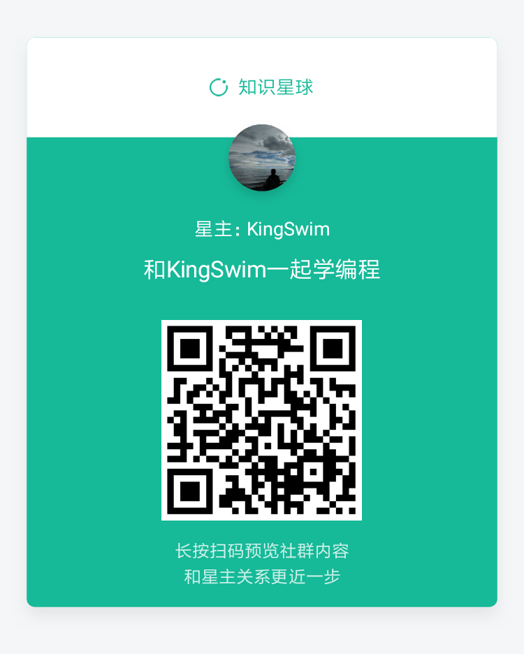

# How-to-learn-programming

## 一、想要达到的目的：

- 对于零基础的，指导你如何快速的入门编程以及学会自学编程；

- 对于有基础的，指导你更快的学习其他编程语言或者其他方向；

- 对于自己来说，给自己的自学、教学经历做一个总结形成经验；

  许久之前，我想过一个问题：想要在这个世界上稍微留下点有用的东西 ? 同时，这些东西还要是自己擅长的，而且短期之内都不会变化的东西。

  自认为教学入门基础知识我是擅长的，毕竟有过真实的教学经历和学生们比较好反馈。

  同时，技术虽然一直都在不断变化中，那些基础性的东西一直都没有变化。

  另外，哪怕突然有一天这些基础知识也完全过时了，如何快速去学习一门课程的经验还是很有用的。

  于是，就诞生了这个教程。

  此想法早就有之；但是，真正付出行动近期才开始。
  
  感谢以下大佬对我的影响，强烈建议大家关注一下他们的公众号。
  
  排名不分先后：[公众号链接](https://www.kingswim.xyz/#/weChat)
  
  最后：希望这个教程对你有用。

## 二、会涉及到的方向：

- 前端开发 （网页已完成，安卓开发未开始） 
- 后端开发 （未开始）
- 爬虫开发 （未开始）

## 三、所教的内容定位：

- 遵循 [28 法则](https://baike.baidu.com/item/28%E6%B3%95%E5%88%99/4524352)，只教必要的入门基础知识点。

  用最少的知识点，做出最多的功能——效率。

## 四、开始之前的准备：

- 初中学历：基本的算术能力以及能默写26 个字母以及会使用[翻译软件](http://fanyi.youdao.com/)；不过据说现在小学都在上英语课了。你要掌握的单词不会超过100个。其实这门课是没有学历要求的，任何人都可以免费学习。对于正真想学的人来说，学历从来就不是问题。
- 一台电脑、两个显示器。请你无论如何准备两个显示器；一个用于看教程，另一个用于对着教程手动实践。这会提高你的学习效率。全新的900左右就可以买到，不介意二手的，可以去[闲鱼](http://app.mi.com/download/433902?id=com.taobao.idlefish&ref=search&nonce=6994175858998620082%3A26102363&appClientId=2882303761517485445&appSignature=sFKrB_4KpXaAVh3qOwY9AmeZdcReHkD5sxWDbsJz9LI)上面淘一淘。
- 在条件允许的情况下把浏览器的默认搜索引擎改为[谷歌](https://www.google.com/)，没有条件请改为[必应](https://cn.bing.com/)，切忌千万不要使用x度。当然如果某天x度符合了程序员的要求，我还是愿意推荐它。
- 软件的下载、安装、文件解压、基本DOS命令（进入文件目录，cd命令）希望你会。不会那就看我的视频吧，都是很简单的操作，还是建议先自己搜索了解一下。
- 申请一个[github](https://github.com/)账户，你可以先不知道怎么用，后续我会抽时间讲解一下基本用法。
- 大部分知识点的教程后面都有一个自练习部分。自己先试试看，不会就搜索引擎，还是有问题就去提[issue](https://github.com/KingSwim404/How-to-learn-programming/issues)——[如何提issue](编程入门/如何提Issue.md)。

## 五、如何使用这个教程：

- 不要仅仅阅读教程，一定要要手敲、要实践；
- 遇到部分理解、看不懂的地方怎么办？先记住就好，后面自然就明白了。
- 敲的时候会有各种各样的低级错误，错到你会怀疑你是不是不适合编程。嗯，这很正常，别放弃继续敲。
- 建议把你的体会可以通过[issue](https://github.com/KingSwim404/How-to-learn-programming/issues)反馈出来，让大家知道不是只有你一个人这样。同时也证明我说的没有错——这是正常的。相信我：那种一眼就能看来少了个分号的技能，以后你也能学会（笑）。
  
## 六、其他的一些说明：

- 编程入门一点也不难，之所以有人觉得难在于：
  1. 编程的知识完全不同于你曾经学过的知识。而且又是一门实践性的知识，你无法通过阅读学会它。在你准备实践的时候，很有可能不是卡在知识点上；​而是卡在了“搭环境”上面，还没摸到门就放弃了。
  2. 看过大量教程和视频之后，我发现没有几个人可以真正教好**<u>入门</u>**。
  
- 自学不是靠自己一个人学习，自学是自己想要学习。重点是学会，而不是学的过程。官方文档、读书、博客、看视频、培训等都属于自学。

- 如果你觉得我讲得啰嗦，那么我不会改；如果你觉得我讲得不清楚，我会改。

- 教基础知识点是我的这个项目的定位。永远不会教高级知识点，变化太快跟不上。当然重点还是我也不会（笑）。

  当然，你要是想要提升，建议去[极客时间](https://www.kingswim.xyz/#/geekTime)上去购买一些专栏看。这是本人做的一个简单的推广网站——利益相关（扫码我会有返现）。

- 对技术不感兴趣的，你可以看看[一些建议](编程入门/03一些建议)里面的文章，也许看完你愿意尝试一下这个教程——技多不压身。

## 七、版权声明：

- 所有原创文章(未进行特殊标识的均属于原创) 的著作权属于 **KingSwim**。
- 除注明外，所有文章均采用
  [Creative Commons BY-NC-ND 4.0](http://creativecommons.org/licenses/by-nc-nd/4.0/deed.zh)协议发布;代码遵循[MIT](LICENSE)协议。
- 所有转载文章(标题注明**[转]**的所有文章) 的著作权属于原作者。
  
  你可以在非商业的前提下免费转载，但请你遵守如下原则：
    - 保持文章原文，不作修改。
    - 明确署名，注明  **作者：KingSwim** 字样以及文章的原始链接。
    - 商业用途请邮箱联系。

## 八、教程目录：

- [目录](编程入门/04目录/目录.md) 

  显示的都是已经完成的模块或者正在写的模块。

## 九、本人的联系方式：

- 称呼：KingSwim

- 邮箱：kingswim404@gmail.com

  学习教程中遇到问题，请提[issue](https://github.com/KingSwim404/How-to-learn-programming/issues)

  官方唯一指定交流社区(免费);审核通过条件:需在[软件工程师宣言](https://github.com/KingSwim404/software-engineer-manifesto)上签名成功。
  
  注意:记得加入星球时，备注你的github信息方便审核。
  
  
  
  