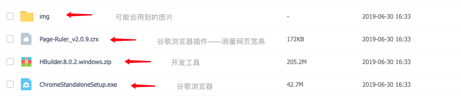

# 开发环境搭建

- ### 开发工具准备

   网页开发你一般需要准备两样东西：浏览器、代码编辑器。

   我给大家准备的是：谷歌浏览器、测量网页插件、HBuilder；强烈要求大家和我使用一样的环境，出问题我好排查。

   - 谷歌浏览器是离线安装文件，点击安装即可；
   
   - 测量网页插件，搜索一下如何离线安装谷歌浏览器插件或者看我后续出的视频；
   
   - HBuilder解压就可以用了；

   - 百度网盘链接：
     [https://pan.baidu.com/s/1moFFpANGrhH-0ZeGSJ2tEA](https://pan.baidu.com/s/1moFFpANGrhH-0ZeGSJ2tEA ) ；提取码：z4ta。
     
     
     
   - 或者微信扫描：
    
     

 

