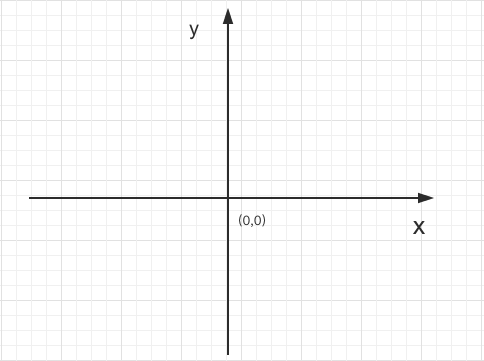

# CSS位置关系00—标签之间的位置关系（实践课）

1. ### 如何确定标签在二维界面上的位置?

   初中数学知识学过二维界面上定位的方式：直角坐标系.
   

   对于我们看到的界面，也有一个默认的坐标系。

   规定：左上角为坐标原点；水平向右是：X 轴正方向；垂直向下是：Y 轴正方向。如下图：
   
   
   
   
2. ### 单个标签在界面的位置：

   一般单个标签默认就在界面的左上角。

   [示例详细代码08](代码相关/demo08.html)

   使用CSS属性：

   ```css
   /*外边距。*/
   margin : 100px 
   ```

   [示例详细代码09](代码相关/demo09.html)

   ```html
   <style>
            *{
                /*距离四个方向都是 0 */
                margin: 0;
            }
            /* margin 有四个方向：left 、right 、top、bottom ；
               left、top就相当于坐标系的（x，y)，用来定具体位置;
               值可以是负数，负数就会跑出界面。可以自己试试。
               没有指定方向，值就是 0 ；
   
            */
           #div00{
               width: 100px;
               height: 100px;
               background: blue;
               /*距离顶部 100px*/
               margin-top: 100px;
               /*距离左边 100px*/
               margin-left: 100px;
               /*距离右边 100px （看不出效果） */
               margin-right: 100px;
               /*距离底部 100px （看不出效果）*/
               margin-bottom: 100px;
           }
   
           /*
              margin 还有 2 种 复合写法
           */
            #div00{
   
                margin: 100px;
                /*
                相当于：所有方向 100px
                margin-top: 100px;
                margin-left: 100px;
                margin-right: 100px;
                margin-bottom: 100px;
                */
            }
   
            #div00{
   
                margin: 100px 200px;
                /*
                相当于：上下 100px ; 左右 200px
                margin-top: 100px;
                margin-left: 200px;
                margin-right: 200px;
                margin-bottom: 100px;
                */
            }
   
            #div00{
   
                margin: 100px 200px 300px 400px;
                /*
                相当于：上:100px ; 右:200px ; 下:300px ; 左:400px （逆时针）
                margin-top: 100px;
                margin-left: 400px;
                margin-right: 200px;
                margin-bottom: 300px;
                */
            }
       </style> 
   
   <div id="div00" >
   </div>
   ```

   

3. ### 两个标签之间的位置关系：

   - ##### 在此之前先学习一下两个概念：块级元素、行内元素；

     块级元素：默认每个元素独占一行，无法水平排列——上下结构。

     行内元素：默认多个可以水平排列，宽度不够换行——左右结构。

     [示例详细代码10](代码相关/demo10.html)

     根据前面学过的标签我们很容易知道：

     块级元素：p 、div

     行内元素：img、a

     注意：

     是否是块级元素还是行内元素是可以通过 CSS 来改变的。

     ```css
     /*行内元素*/
     display: block;
     /*行内元素*/
     display: inline-block;
     ```

     [示例详细代码11](代码相关/demo11.html)

   - ##### 以后会主要使用 div 来演示位置关系

     有一个关键点：两个标签垂直方向的margin 会有折叠，

     - 如果 margin 都是正数，则取他们当中的最大值
     - 如果 margin 中有正有负，则取最大的正数加上最小的负数（如最大的 margin 是 20px，最小的 margin 是 -20px，则他们计算后的值是 0）
     - 如果 margin 中都是负数，则取他们当中的最小值

     [示例详细代码12](代码相关/demo12.html)，希望你自己手动修改代码测试一下上面的结论；
     
     

4. ### 自练习：

   - 完成 margin 叠加的状态
   - 思考：如果把某个标签放到界面的正中间？

   


