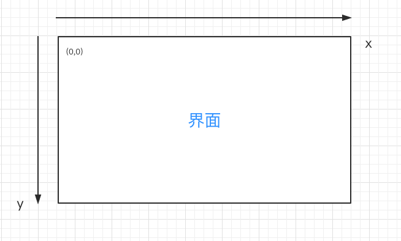

# CSS位置关系00—标签与标签之间的关系

1. 如何确定标签在二维界面上的位置?

   初中数学知识学过二维界面上定位的方式：直角坐标系.
   

   对于我们看到的界面，也有一个默认的坐标系。

   规定：左上角为坐标原点；水平向右是：X 轴正方向；垂直向下是：Y 轴正方向。如下图：
   
   
2. CSS控制任意标签在界面的位置

   一般单个标签默认就在界面的左上角。

   [示例详细代码08](代码相关/demo08.html)

   新CSS属性：margin  外边距。

   [示例详细代码09](代码相关/demo09.html)

   ```html
   <style>
            *{
                /*距离四个方向都是 0 */
                margin: 0;
            }
            /* margin 有四个方向：left 、right 、top、bottom ；
               left、top就相当于坐标系的（x，y)，用来定具体位置;
               值可以是负数，负数就会跑出界面。可以自己试试。
               没有指定方向，值就是 0 ；
   
            */
           #div00{
               width: 100px;
               height: 100px;
               background: blue;
               /*距离顶部 100px*/
               margin-top: 100px;
               /*距离左边 100px*/
               margin-left: 100px;
               /*距离右边 100px （看不出效果） */
               margin-right: 100px;
               /*距离底部 100px （看不出效果）*/
               margin-bottom: 100px;
           }
   
           /*
              margin 还有 2 种 复合写法
           */
            #div00{
   
                margin: 100px;
                /*
                相当于：所有方向 100px
                margin-top: 100px;
                margin-left: 100px;
                margin-right: 100px;
                margin-bottom: 100px;
                */
            }
   
            #div00{
   
                margin: 100px 200px;
                /*
                相当于：上下 100px ; 左右 200px
                margin-top: 100px;
                margin-left: 200px;
                margin-right: 200px;
                margin-bottom: 100px;
                */
            }
   
            #div00{
   
                margin: 100px 200px 300px 400px;
                /*
                相当于：上:100px ; 右:200px ; 下:300px ; 左:400px （逆时针）
                margin-top: 100px;
                margin-left: 400px;
                margin-right: 200px;
                margin-bottom: 300px;
                */
            }
       </style>    
   <div id="div00" >
   </div>
   ```

   

