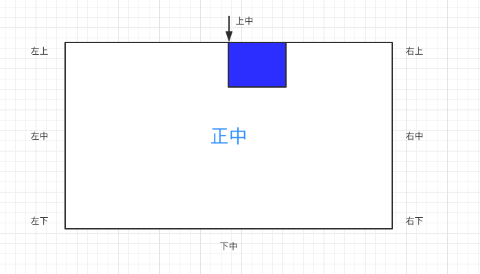
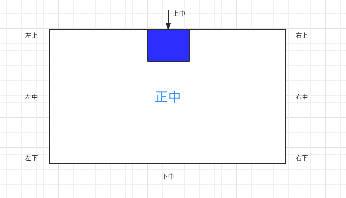

# CSS位置关系01—界面的上 9 大特殊点（实践课）

1. ### 学习 9 大特殊位置( 很重要 )

   我们已经掌握如何把一个标签设置在任意位置。但是二维界面上的 9 个重要的位置缺无法通过之前的方式做到。

   9 大重要位置如下：
   
   
   ```css
   /*左上：默认的；*/
   /*上中（水平居中）一般情况使用这种写法。下面会教新的写法。*/
   margin: 0 auto;
   ```
   
   [示例详细代码13](代码相关/demo13.html)
   
   但是，如果你放多个 div 标签，他们之间会互相影响。
   
   现在，为了标签之间不互相影响，每个点位置都是独立的。我们需要学习几个新的 CSS属性。
   
   ```css
   /*position 属性一般称为定位。 它可以取值多个。这次学：absolute —— 绝对定位。*/
   position: absolute;
   
   /*一下属性类似margin.但是必须要和position属性配合使用。不然设置无效果。
   （后续会慢慢有一些 CSS 属性需要一切设置才会生效。）
   */
   left: 0;
   top: 0;
   right: 0;
   bottom: 0;
   
   /*平移,(x,y) 指代x轴，y轴移动的距离*/
   transform: translate(x, y) ;
   ```
   
   一般来说，写完前 5个,后续的就明白怎么写了，很有规律。
   
   - 左上
   
     默认就是不讲解了。
   
   - 上中
   
     [示例详细代码14](代码相关/demo14.html)
   
     ```css
     #top_mid{
                width: 100px;
                height: 100px;
                background: blue;
                /*先设置成绝对定位*/
                position: absolute;
                /*类似margin.但是必须要和position属性配合使用*/
                /*此百分比，对应的是父元素50%*/
                left: 50%;/*距离父元素左边50%*/
                top: 0;/*距离父元素顶部 0 */
             }
     <div id="top_mid" ></div>
     ```
   
     以上代码效果如下：
     
     
     之前有讲过：左上角是原点。如果，需要在上中位置。蓝块还需要往左移动自身长度的一半。
     
     新增一句 CSS 代码即可：
     
     ```css
      transform: translate(-50%, 0) ;/*此百分比，对应的是自身的50% ,往左是负数*/
     ```
     
     完整代码如下：
     
     ```css
     #top_mid{
                width: 100px;
                height: 100px;
                background: blue;
                /*先设置成绝对定位*/
                position: absolute;
                /*类似margin.但是必须要和position属性配合使用*/
                /*此百分比，对应的是父元素50%*/
                left: 50%;/*距离父元素左边50%*/
                top: 0;/*距离父元素顶部 0 */
                transform: translate(-50%, 0) ;/*此百分比，对应的是自身的50%*/
              }
        <div id="top_mid" ></div>
     ```
     以上代码效果如下：
     
     
     剩下7个点的代码见[示例详细代码15](代码相关/demo15.html)。（只教到正中，其他位置自行写出来）
   
2. ### 自练习：

   - 完成剩下的“右中”、“左下”、“下中”、“右下”点的 CSS 代码。

