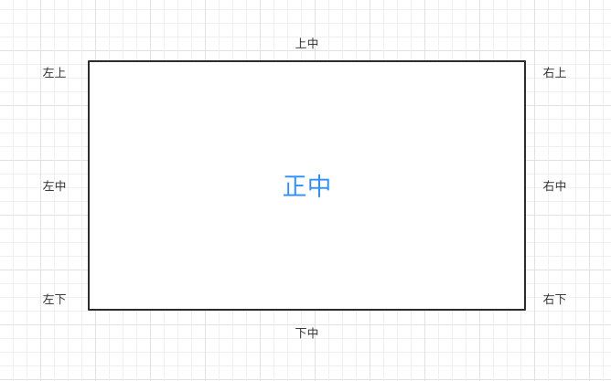

# CSS位置关系01—界面的上 9 大特殊位置

1. ### 学习 9 大特殊位置( 很重要 )

   我们已经掌握如何把一个标签设置在任意位置。但是二维界面上的 9 个重要的位置缺无法通过之前的方式做到。

   9 大重要位置如下：
   
   
   ```css
   /*左上：默认的；*/
   /*上中（水平居中）一般情况使用这种写法。下面会教新的写法。*/
   margin: 0 auto;
   ```
   
   [示例详细代码13](代码相关/demo13.html)
   
   但是，如果你放多个 div 标签，他们之间会互相影响。
   
   现在，为了标签之间不互相影响，每个点位置都是独立的。我们需要学习一个新的 CSS属性。
   
   ```
   
   ```
   
   
