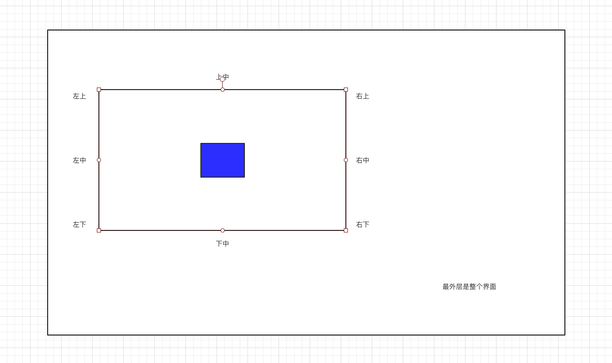

# CSS位置关系02—父子标签中子标签定位（实践课）

1. ### 如何做到如下效果？
   
   一个父 div里面的子 div 定位在父 div 的正中（如下）——用之前的知识点，做不到，需要学新 的CSS属性。
   
   
   
   ```css
   /*这次学：relative —— 相对定位。*/
   position: relative;
   ```
   
   [示例详细代码16](代码相关/demo16.html)
   
   

