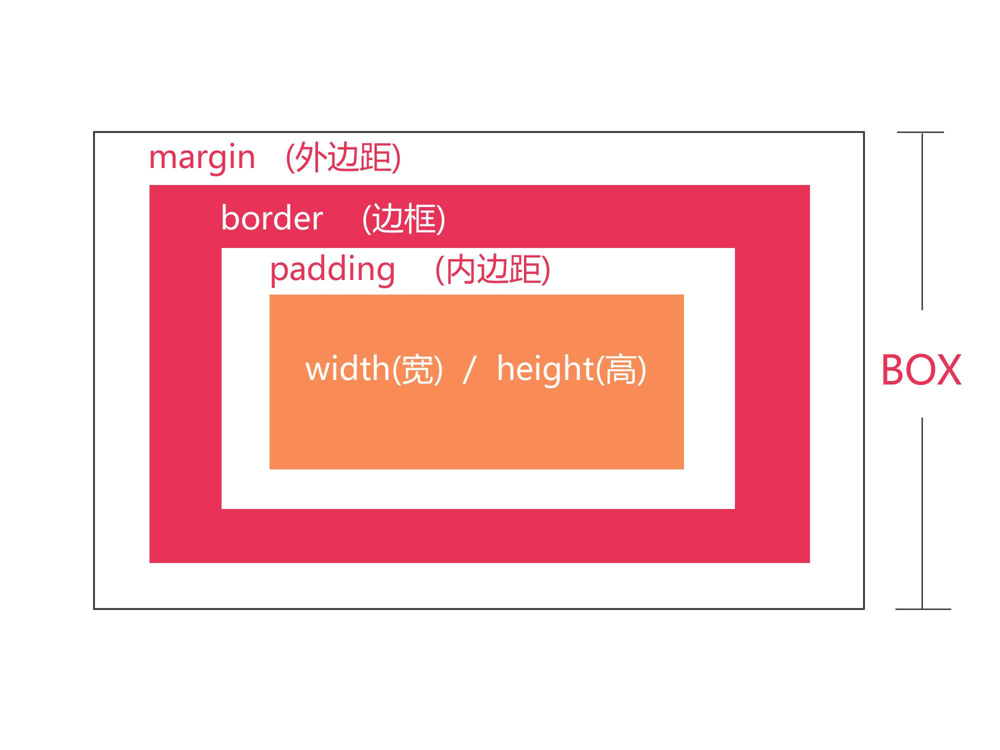

# HTML、CSS增补知识点01(实践课)

这次知识点有点多，记不住没有关系，后续的小练习中我会继续教。但是你一定要手写练练留一个映象即可。

1. ### HTML 标签增补知识点

   - [实体字符](http://www.w3school.com.cn/html/html_entities.asp)

     ```html
     HTML多个空格会被识别成一个。
     示例：
     <p>King    Swim</p>   ====>  界面：King Swim
     如果，要表示多个空格你需要用：&nbsp;代替" "
     示例：
     <p>King&nbsp;&nbsp;&nbsp;&nbsp;Swim</p>   ====>  界面：King    Swim
     &nbsp; 就是实体字符。
     比较重要的几个实体字符：
     <   &lt;  
     >   &gt;
     ®   &reg;
     < 、 >会被浏览器解析成标签，所以一定要用实体字符，其他字符自行点击上面的链接学习。
     ```

   - 新标签

     - span

       文本标签——和 p 标签不同的是，它属于行内元素，界面显示排成一行。

       ```html
       <span>我也是一个文本标签0</span>
       <span>我也是一个文本标签1</span>
       
        显示如下：
        我也是一个文本标签0我也是一个文本标签1
       ```

     - br

       换行标签——行内元素默认都在一行，需要换行就使用它。

       ```html
       <span>我也是一个文本标签0</span>
       <br/>
       <span>我也是一个文本标签1</span>
       
       显示如下：
       我也是一个文本标签0
       我也是一个文本标签1
       ```

     - ol、li

       有序列表标签——默认竖排,默认序号数字 1 开始。

       ```html
       <ol >
           <li>KingSwim0</li>
           <li>KingSwim1</li>
           <li>KingSwim2</li>
           <li>KingSwim3</li>
           <li>KingSwim4</li>
       </ol>
       
       <!-- type：序号类型   ；start ：从哪个位置开始 -->
       <!-- 意思是 ：字母为序号，从字母 C 开始-->
       <ol id="ol01" type="A"  start="3" >
           <li>KingSwim0</li>
           <li>KingSwim1</li>
           <li>KingSwim2</li>
           <li>KingSwim3</li>
           <li>KingSwim4</li>
       </ol>
       ```

     - ul、li

       无序列表标签——默认竖排

       ```html
       <style>
       #ul02{
               /*去掉无序列表前面的点。*/
               list-style: none;
           }
       </style>
       
       <ul id="ul01" >
         <li>KingSwim0</li>
           <li>KingSwim1</li>
         <li>KingSwim2</li>
           <li>KingSwim3</li>
         <li>KingSwim4</li>
       </ul>
       
       <ul id="ul02" >
           <li>KingSwim0</li>
           <li>KingSwim1</li>
           <li>KingSwim2</li>
           <li>KingSwim3</li>
           <li>KingSwim4</li>
       </ul>
       ```
     
     - input
     
       输入框
     
       ```html
       <!-- 一般的输入框  type：决定类型 -->
       <input type="text"   />
       
       <!-- 一般的输入框 value ：默认值，输入不消失。 -->
       <input type="text"  value="KingSwim" />
       
       <!-- placeholder ：设置提示语 ，输入就消失-->
       <input type="text"  placeholder="请输入密码" />
       
       <!--密码框-->
       <input type="password"   />
       
       <!--只能输入数值-->
       <input type="number"   />
       
       <!--按钮，  value：按钮上面的文案-->
       <input type="button"  value="按钮" />
       <!--下面也是按钮，一般建议用下面的。-->
       <button>按钮</button>
       ```

   ​	[示例详细代码20](代码相关/demo20.html)，自行练习一下。
   
2. ### CSS 增补知识点

   [示例详细代码21](代码相关/demo21.html)

   - 内边距——padding

     控制标签内部的区域范围和 margin（外边距，恰恰相反）

     ```css
     #outer{
           width: 400px;
           height: 400px;
           background: #0000FF;
           /*
             自己的左边50px的区域无法放置任意标签
             效果和：在inner上面设置 margin-left: 50px;一样。（自己尝试一下。）
            */
           padding-left:50px ;
          }
     
       #inner{
           width: 50px;
           height: 50px;
           background: red;
          }
     
     <div id="outer">
         <div id="inner"></div>
     </div>
     
     ```
   - 背景图片设置（很重要，多尝试）

     其实任意标签页可以当做img标签使用。

     注意：img不设置宽高图片会显示出来。但是块级元素需要设置宽高，内联元素设置宽高也没用需要先设置为块级元素。

     ```css
     /*图片要完整显示，宽高必须要设置和图片大小（分辨率）一致*/
      #div00{
           width: 561px;
           height: 533px;
           background-image: url("imgs/kingswim.png") ;
          }
     
     /*非要调整图片大小，就要使用background-size，调节图片大小*/
       #div01{
           width: 200px;
           height: 200px;
           background-image: url("imgs/kingswim.png") ;
           background-size: 200px 200px ;
          }
     
     
             /*内联元素要先设置成块级元素。不然宽高没有效果*/
        #span00{
           width: 100px;
           height:100px;
           background-image: url("imgs/kingswim.png");
           background-size: 100px 100px ;
           display: block;
           /*或者如下*/
           /*display: inline-block;*/
          }
     <div id="div00"></div>
     <div id="div01"></div>
     <span id="span00"></span>
     ```    
   - 文本居中

     ```css
        #p00{
            width: 200px;
            height: 50px;
            /*只能做到文本水平居中，要想垂直居中还要用到下面的属性*/
            text-align: center;
            /*这个属性叫做行高：行高设置和高度一致，就会垂直居中。*/
            line-height: 50px;
            background: #00FF00;
          }
     <p id="p00">KingSwim</p>
     ```
   - 边框

     ```css
     /* 设置边框*/
       #div02{
            width: 200px;
            height: 50px;
            /*边框的宽度：10px，边框的类型solid 实线（其他虚线，点，自行学习），边框的颜色：red*/
            border: 10px solid red;
            /*边框的圆角：*/
            border-radius: 10px;
          }
     <div id="div02"></div>
     ```
   - 元素排成一行

     ```css
         /*
            元素排成一排，之前学的是： display: inline-block;
            现在学一个新的属性，也是以后经常用的： float: left;
         */
         /* 列表排成一行*/
           #ul0{
               /*宽度不能小于所有子标签宽度之和，不然子标签就会换行。（亲自试试看）*/
               width: 250px;
               height: 50px;
               background: rebeccapurple;
           }
           #ul0>li{
               width: 50px;
               height: 50px;
               background: #0000FF;
               /*左浮动。（自己试试右浮动看看，特殊情况会有妙用）*/
               float: left;
               display: inline-block;
               list-style: none;
           }
     
     <ul id="ul0">
         <li></li>
         <li></li>
         <li></li>
         <li></li>
         <li></li>
     </ul>
     ```

   - 内容溢出如何处理

     学习属性：overflow

     - 裁剪

       ```css
       #div03{
          width: 400px;
          height: 400px;
          /*裁剪掉溢出的*/
          overflow: hidden;
         }
       
       <div id="div03">  
           
       </div>
       ```

     - 显示滑动条

       ```css
       #div03{
          width: 400px;
          height: 400px;
         /*可以显示，但是需要拖动拖动条*/
         overflow: scroll;
        }
       
       <div id="div03">  
           
       </div>
       ```

   - 鼠标悬停（很重要）

     学习属性：hover

     - 鼠标悬停，自己变化

       ```css
       #div04{
           width: 200px;
           height: 200px;
           background: red;
         }
        /*鼠标悬停，背景变成蓝色，移走还原；当然也可以修改其他属性。（自己尝试）*/
       #div04:hover{
           background: blue;
          }
     
       <div id="div04"></div>
       ```

     - 鼠标悬停父元素，子元素变化

       ```css
       #div05{
             width: 400px;
             height: 400px;
             background: yellow;
           }
     
       #div06{
             width: 50px;
             height: 50px;
             background: green;
           }
     
       /*鼠标悬停父元素，子元素背景变成紫色，移走还原；*/
       #div05:hover>#div06{
             background: purple;
            }
       <div id="div05">
         <div id="div06"></div>
       </div>
       ```

       总结规则：
     
       ```css
       :前面是谁，就是谁监听；大括号前面最近是谁，就是谁改变。
       #div05:hover>#div06{}
       :前面是div05，所以监听悬停的是div05； {}前面最近的是div06 ，最后CSS改变的就是div06
       自己多尝试一下吧。
       ```
            
3. ### 盒模型
   
   [示例详细代码22](代码相关/demo22.html)

   学习属性：box-sizing ,
   
   ```css
   /*
     默认值：不设置就是此种模式。
     真实宽度(界面显示) = width+ pading-left + pading-right + boder-left + boder-right
   */
   box-sizing:content-box;
   /*
     真实宽度(界面显示)是固定的，设置的width是多少就是多少；不会被内边距和边框所影响。但是，因为宽度固定,设置内   
     边距和边框会挤压内容。
   */
   box-sizing: border-box;
   ```
   
   
   
   ```css
           * {
              margin: 0;
              padding: 0;
           }
          div {
              width: 200px;
              height: 200px;
           }
   
        .div00 {
               border: 50px solid goldenrod;
               padding: 50px;
               background-color: red;
               box-sizing: border-box;
           }
   
        .div01 {
               border: 50px solid olivedrab;
               padding: 50px;
               background-color: blue;
               box-sizing: content-box;
           }
   <div class="div00"></div>
   
   <div class="div01"></div>
   ```
   
4. ### 总结：

   大部分标签都可以当做文本以及图片标签使用。但是，一般请不要这么做。每个标签都有其自身的含义，尽量别乱用。

   后续，很少单独列增补知识点。之前的知识点，也会不断在在后续的小练习中继续重复——边做边学——做中学。

   下面的教程就开始做一些小练习。