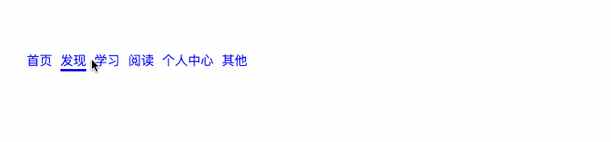

# 小练习01—一级菜单（实践课）

1. ### 实现如下效果：

   1. HTML
   
      ```html
      <ul>
          <li><a href="#">首页</a></li>
          <li><a href="#">发现</a></li>
          <li><a href="#">学习</a></li>
          <li><a href="#">阅读</a></li>
          <li><a href="#">个人中心</a></li>
          <li><a href="#">其他</a></li>
      </ul>
      ```
   
   2. CSS
   
      ```css
      
              *{
      
                  margin: 0;
                  padding: 0;
              }
      
      
              ul li{
                  /* 去掉无序列表前面的点 */
                  list-style: none;
                  /* 排成一行 */
                  float: left;
                  margin-right: 10px;
                  /*
                    rgba : 前面三个参数是10进制的颜色值：范围 0-255 ( FF转化为 10进制 最大为 255)。
                           最后一个参数是透明度0.0 - 1.0之间的小数。
      
                   边框可以单独设置某一个方向有。
                   border-bottom：就是底部有边框，其他方向没有。
                   */
      
                  border-bottom:3px solid rgba(0,0,0,0) ;
              }
      
              ul li a{
                  /*去掉 a 的 下划线*/
                  text-decoration: none;
              }
      
              ul li:hover{
                  /* 设置指定某个方向的边框颜色 */
                  border-bottom-color:blue ;
              }
      ```
   
      
   
   3. 完整代码
   
      [示例详细代码24](代码相关/demo24-primary-menu.html)
   
   4. 总结
   
      - 使用边框可以单独设置不同方向，很容易做到一些“指示剂”的效果。
   
      - 学习的时候可以试着去多发现一些CSS 熟悉的复合以及分离的写法。
   
        类似：backgroud 、border、margin等
   
2. ### 自练习：

   - 让整个菜单水平居中。

   

   

