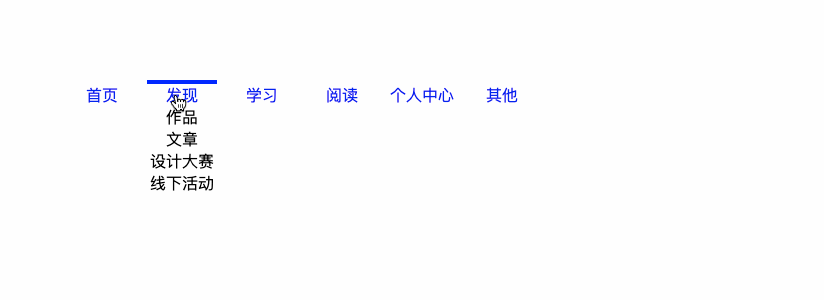

# 小练习02—二级菜单（实践课）

1. ### 实现如下效果：
  1. HTML

     ```html
     <ul class="menu">
         <li><a href="#">首页</a></li>
         <li>
             <a href="#">发现</a>
             <ul class="child">
                 <li>作品</li>
                 <li>文章</li>
                 <li>设计大赛</li>
                 <li>线下活动</li>
             </ul>
         </li>
         <li>
             <a href="#">学习</a>
             <ul class="child">
                 <li>前端入门</li>
                 <li>Android</li>
                 <li>iOS</li>
                 <li>Node</li>
             </ul>
         </li>
         <li><a href="#">阅读</a></li>
         <li><a href="#">个人中心</a></li>
         <li><a href="#">其他</a></li>
     </ul>
     ```

  2. CSS

     ```css
     
             *{
                 margin: 0;
                 padding: 0;
             }
     
     
             .menu{
                 width: 480px;
                 /*水平居中。注意：如果不设置宽度（480 是计算出来的），以下居中写法没有效果。*/
                 margin: 300px auto;
             }
     
             /*去掉a标签的下划线*/
             a{
                 text-decoration: none;
             }
     
             /*去掉列表前面的点*/
             li{
                 list-style: none;
             }
     
             /* 隐藏二级菜单 */
             .menu .child{
                 /* 设置为不可见 （新知识）*/
                 display: none;
             }
     
             /* > 代表选中直接子类 */
             .menu>li{
     
                 /*左浮动，可以把标签排成一行*/
                 float: left;
                 margin-right:10px ;
     
                 /*前面三个参数代表10进制的颜色值，最后一个代表透明度0~1*/
                 border-top:4px solid rgba(0,0,0,0) ;
     
                 /* 子菜单里面的文字偏多，会影响整个宽度，提前设置一个宽度 */
                 width: 70px;
                 /* 文本水平居中 */
                 text-align: center;
             }
     
             /* 一级菜单头部的指示剂 */
             .menu>li:hover{
                 border-top-color: blue ;
             }
     
             /*二级菜单显示*/
             .menu>li:hover .child{
                 /* 不仅仅是设置为块元素，还有显示的作用 */
                 display: block;
             }
     
     ```

     

  3. 完整代码

     [示例详细代码25](代码相关/demo25-multi-menu.html)

  4. 总结

     - 标签的嵌套要注意，按之前的规范来。
     - 使用 margin 控制水平居中，要注意被设置的标签一定要有宽度（tips：设置一个背景颜色，观察一下)。
     - 标签设置不可见：display: none; 设置可见：display: block;

2. ### 自练习：

   - 练习此到案例，可以完全独立完成。