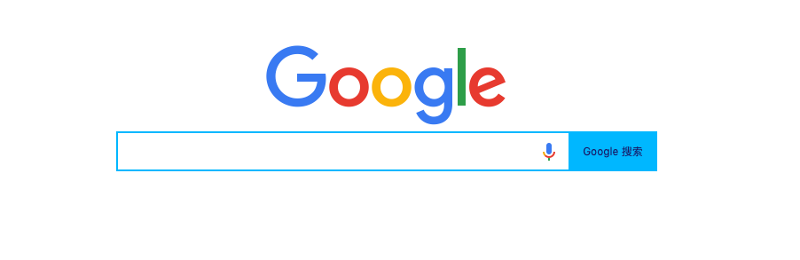

# 小练习04—定位练习（Google）（实践课）

1. ### 实现如下效果：

   1. HTML

      ```html
      <div class="content">
          
          <div class="input-container">
              <input type="text" />
              <a href="#"></a>
              <input type="button" value="Google 搜索" />
          </div>
      </div>
      ```

   2. CSS

      ```css
              * {
                  margin: 0;
                  padding: 0;
              }
      
              .content {
                  /*
                   不设置宽度，无法水平居中
                   div宽度默认占满一行。
                  */
                  width: 610px;
                  margin: 300px auto;
                  text-align: center;
              }
      
              .content .input-container {
                  /* 宽高自行定义即可 */
                  width: 610px;
                  height: 45px;
                  /* 由于里面的子元素，需要相对它定位。 但是自己的位置不需要动。所以设置为：relative */
                  position: relative;
              }
      
              /*
               新CSS选择器：
               input[type=text] ：代表 type=text的 input 标签。
              */
              .content .input-container input[type=text] {
                  width: 500px;
                  /* 因为有边框所以高度 = 35px - 2px - 2px */
                  height: 41px;
                  border: 2px solid deepskyblue;
                  /* 单独取消右边边框 */
                  border-right: none;
                  /* 取消 input 的默认边框线 */
                  outline: none;
                  /* 让光标距离左边有一定的距离。光标数据内容，所以用 padding */
                  padding-left:8px ;
                  /*
                    排成一行。
                    注意：
                    虽然，input默认是一行。但是，由于标签之间的换行或者空格会占用一点位置，宽度固定无法放到         
                    一行。(详细解释，见完整代码)
                  */
                  float: left;
              }
      
              .content .input-container input[type=button] {
                  /* 宽度 = 610px - 500px - 2px（border-left ） - 8px (padding-left)  */
                  width: 100px;
                  height: 45px;
                  background-color: deepskyblue;
                  color: midnightblue;
                  border: none;
                  /* 排成一行 */
                  float: left;
                  /* 取消 input 的默认边框线 */
                  outline: none;
      
              }
              /*不设置宽高，背景图不显示。但是a标签没有宽高。所以要设置成display: block;*/
              .content .input-container a{
                  width: 24px;
                  height: 24px;
                  display: block;
                  background: url("imgs/img-position-google/googlemic.png");
                  background-size: 24px 24px;
                  /* 垂直居中 */
                  position: absolute;
                  top: 50%;
                  transform: translateY(-50%);
                  /*距离只要大于：button的宽度(100)即可*/
                  right: 110px;
              }
      ```

   3. 完整代码

      [示例详细代码27](代码相关/demo27-position-training-gl.html)      

   4. 总结

      - 复习：定位规则，一定要熟练掌握。
      - 新 CSS选择器：  input[type=**xxx**] : 代表 type=**xxx**的 input 标签。
      - 新 CSS属性：outline: none; 取消 input 的默认边框线 。
      - 有的时候标签之间由于换行或者空格，在界面显示上有一定的间隙。这个时候一般建议使用：float属性
      - 熟练掌握宽度的计算——盒模型

2. ### 自练习：

   - 不要使用百度搜索资料。
   - 手写[必应](https://cn.bing.com/)的首页搜索框部分。
   - 现在的小练习代码量有点多，但是一定要练到可以自己独立写出来——先模仿，后理解。