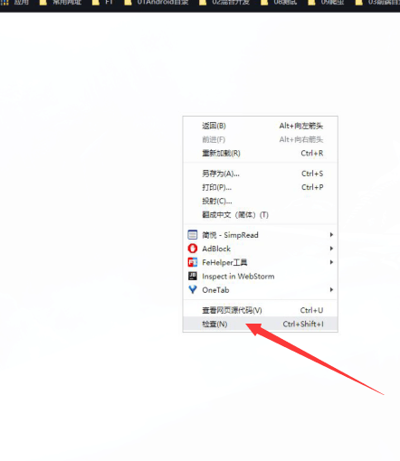
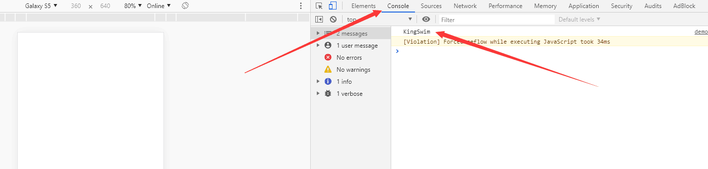

# 38JavaScript—程序语言入门

- ### JavaScript在HTML的位置

  ```html
  <!DOCTYPE html>
  <html lang="en">
  <head>
      <meta charset="UTF-8">
      <title>Title</title>
  </head>
  <body>
  </body>
  <script >
      /*
      这个位置：一般处于body标签下面。
               先这么写；其实，还可以放其他位置。
       */
  </script>
  </html>
  ```

  

- ### 变量

  1. 变量表示：
  
     [示例详细代码47](代码相关/demo47-JavaScript-location.html)
  
   - 如何表示一个数值
  
     ```javascript
     let  count  = 7;    //整数
     let  height = 1.78; //小数
     ```
  
   - 如何表示一个布尔值
  
     ```javascript
     let isRich = true;  //真
     let isPoor = false; //假
     ```
  
  - 如何表示一个字符串（文本）
  
    ```javascript
    let name = "KingSwim";
    ```
    
    ### 注意：
    
    1、变量的名字要取得有意义，不要随便取值，更不要用拼音。
    
    2、切记，变量名不要重复。
  
       ```javascript
    let name = "KS";
    let name = "SK"; //错
       ```
    ​     
  2. 变量打印：
  
     - 使用弹框：
  
       ```javascript
       alert(height);
       ```
  
       运行HTML，这个可以直接看到一个弹框打印出数据。
  
     - 使用控制台：
  
       ```javascript
       console.log(name);
       ```
  
       这个看不到效果，需要调出浏览器的控制台。
  
       如图所示，如果看不明白可以去搜索：如何调出谷歌浏览器的控制台。
       第一步：在页面上右键鼠标，选中检查;
       
       
       第二步：找到Console选项。下面的“KingSwim”；即是：代码执行的结果。
       
     
  3. 变量运算：
  
     [示例详细代码48](代码相关/demo48-JavaScript-compute.html)
  
     - 数值运算
  
       ```javascript
       let x = 10;
       let y = 20;
       let sum = x + y; // +（加） 、-（减） 、*（乘） 、/（除）
       console.log(sum);
       /*
        注意：% 求余符号：求余数。
        */
       console.log(4%5);   //结果是:4
       console.log(10%3);  //结果是:1
  
       ```
       
     - 布尔运算
  
       ```javascript
           /*
            布尔运算：与（&&）、或（||）、非（!）
            与：所有的都为真，才是真。
            或：有一个为真，即为真。
            非：取反。
            */
           console.log(true && false); //结果是：false
           console.log(true || false); //结果是：true
           console.log(!true ); //结果是：false
       ```
  
       
  
     - 字符串运算
  
       ```javascript
           /*
            字符串运算：拼接。
           */
       
           let name01 = "King";
           let name02 = "Swim";
       
           console.log(name01 + name02); //结果：KingSwim;
       ```
  
       
  
  4. 修改变量：
  
     ```javascript
     let x = 10;
         x = 20;
     console.log(x); // 20 
         
     ```
  
  

